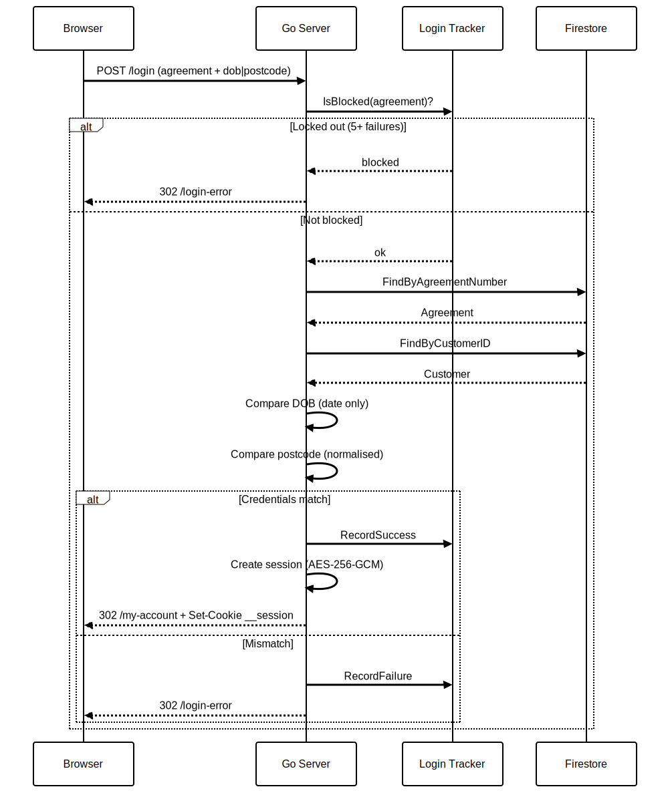
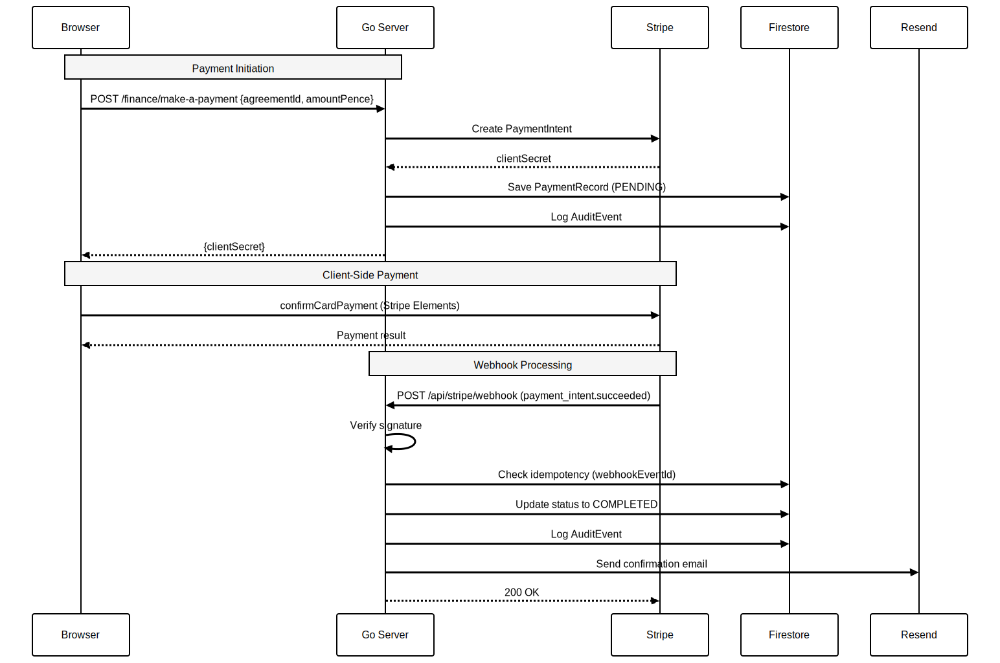

# Azadi Financial Services -- Customer Portal

Online finance portal for Azadi, an imaginary luxury car manufacturer. Lets customers view agreements, settle payments,
retrieve documents, and keep contact details up to date, all in one place.

built with **Go 1.24**, `net/http`, `html/template`, and **Firestore in Datastore mode**. Payments via **Stripe**,
emails via **Resend**, deployed on **Cloud Run** behind **Firebase Hosting**.


## Architecture

<p align="center">
  
</p>

### Request Flow

<p align="center">
  
</p>

### Layered Architecture

<p align="center">
  
</p>

---

## Data Model

Uses **Firestore in Datastore mode** with `cloud.google.com/go/datastore`. All entities use auto-generated `int64` IDs.

<p align="center">
  
</p>

---

## Authentication Flow

3-factor login: agreement number + date of birth + UK postcode. AES-256-GCM encrypted sessions. 5-attempt lockout with 30-minute lock.

<p align="center">
  
</p>

---

## Payment Flow

Stripe Elements frontend + server-side PaymentIntent creation + webhook processing with idempotency.

<p align="center">
  
</p>

---

## Project Structure

```
├── diagrams/                       # Architecture diagrams (.mmd source + .svg)
├── azadi-go/
│   ├── cmd/server/main.go          # Entry point — wires dependencies, starts server
├── internal/
│   ├── repo/repo.go                # Generic Datastore repository (Store[T])
│   ├── domain/interfaces.go        # Shared interfaces (AuditLogger, AgreementLister)
│   ├── httputil/httputil.go        # Handler helpers (ServerError, PathInt64, RenderFunc)
│   ├── model/                      # Datastore entity structs + formatting
│   │   ├── base.go                 #   Embedded Base with ID + repo.Entity constraint
│   │   ├── agreement.go            #   Finance agreement
│   │   ├── customer.go             #   Customer profile
│   │   ├── payment.go              #   Stripe payment record
│   │   ├── bank_details.go         #   Encrypted bank details
│   │   ├── settlement.go           #   Early settlement figure
│   │   ├── statement.go            #   Statement request
│   │   ├── document.go             #   Customer document
│   │   ├── audit_event.go          #   Audit trail event
│   │   └── format.go               #   FormatPence, DayWithSuffix
│   ├── config/config.go            # Environment-based configuration
│   ├── server/server.go            # HTTP routes, middleware chain, templates
│   ├── auth/                       # Authentication & session management
│   │   ├── handler.go              #   Login/logout HTTP handlers
│   │   ├── provider.go             #   Agreement + DOB + postcode auth
│   │   ├── session.go              #   AES-256 encrypted cookie sessions
│   │   ├── middleware.go            #   RequireAuth + context helpers
│   │   ├── tracker.go              #   Login attempt tracking & lockout
│   │   ├── ratelimit.go            #   3-tier rate limiting middleware
│   │   └── repository.go           #   Customer Datastore queries
│   ├── middleware/                  # Security middleware
│   │   ├── csp.go                  #   CSP nonce generation
│   │   ├── csrf.go                 #   CSRF token cookie + validation
│   │   ├── security.go             #   HSTS, X-Frame-Options, etc.
│   │   └── logging.go              #   Structured request logging
│   ├── agreement/                  # View agreements
│   ├── payment/                    # Stripe payments + webhook
│   ├── paymentdate/                # Change payment date (once per agreement)
│   ├── bank/                       # Update bank details (AES-256 encrypted)
│   ├── contact/                    # Update contact details
│   ├── settlement/                 # Request settlement figure (balance + 2%)
│   ├── statement/                  # Request statement
│   ├── document/                   # View/download documents
│   ├── help/                       # FAQs, Ways to Pay, Contact Us
│   ├── email/                      # Resend API integration + HTML templates
│   ├── audit/                      # Async audit event logging
│   ├── seed/                       # Dev data seeder from JSON
│   ├── validate/                   # UK postcode, sort code, agreement number
│   └── testutil/                   # Datastore emulator test helper
├── templates/                      # Go html/template files
├── frontend/                       # Vite frontend (CSS + JS)
│   ├── seed/customers.json          # Dev seed data (5 customers)
├── Dockerfile                      # Multi-stage production build
├── compose.yml                     # Firestore emulator for local dev
├── firebase.json                   # Firebase Hosting + emulator config
└── local.env                       # Local development env vars
```

---

## Getting Started

### Prerequisites

- **Go 1.24+**
- **Node.js 20+** (for Vite frontend build)
- **Docker** (for Firestore emulator)

### 1. Start the Firestore Emulator

```bash
docker compose up -d firebase-emulator
```

### 2. Build Frontend Assets

```bash
cd frontend && npm install && npm run build && cd ..
```

### 3. Run the Application

```bash
source local.env
export DATASTORE_EMULATOR_HOST=localhost:8081
go run ./cmd/server/
```

The server starts on `http://localhost:8080`. Seed data is loaded automatically on first boot when `SEED_DATA=true`.

### 4. Login with Demo Credentials

| Agreement Number   | Date of Birth  | Postcode   |
|--------------------|----------------|------------|
| AGR-100001         | 15/3/1985      | SW1A 1AA   |
| AGR-100002         | 22/7/1990      | E1 6AN     |
| AGR-100003         | 5/12/1978      | M1 1AE     |
| AGR-100004         | 30/9/1995      | B1 1BB     |
| AGR-100005         | 8/4/1982       | LS1 1BA    |

---

## Development

### Devcontainer

```bash
devcontainer up .

# Claude Code
devcontainer exec claude --dangerously-skip-permissions
```

### Run Tests

```bash
# Unit tests (no emulator needed)
go test ./...

# Full suite with integration tests
docker compose up -d firebase-emulator
DATASTORE_EMULATOR_HOST=<emulator-host>:8081 go test ./... -timeout 120s

# With coverage
DATASTORE_EMULATOR_HOST=<emulator-host>:8081 go test -coverprofile=coverage.out ./internal/...
go tool cover -func=coverage.out | tail -1
```

**Current coverage: 76%+ (232 tests across 18 packages)**

### Hot Reload

```bash
# Backend (install air: https://github.com/air-verse/air)
air

# Frontend HMR
cd frontend && npm run dev
# Set VITE_DEV_URL=http://localhost:5173 in your env
```

### Regenerate Diagrams

Mermaid source files live in `diagrams/*.mmd`. To re-render SVGs:

```bash
npx @mermaid-js/mermaid-cli -i diagrams/<name>.mmd -o diagrams/<name>.svg -b white
```

### Production Build

```bash
docker build --build-arg VITE_STRIPE_PUBLISHABLE_KEY=pk_live_xxx -t azadi .
docker run -p 8080:8080 azadi
```

~15MB binary. ~30s build. Instant startup.

---

## Configuration

All configuration via environment variables. No YAML files.

| Variable                      | Default               | Description                                  |
|-------------------------------|-----------------------|----------------------------------------------|
| `PORT`                        | `8080`                | HTTP listen port                             |
| `ENVIRONMENT`                 | `dev`                 | `dev` or `main` (production)                 |
| `GCP_PROJECT_ID`              | `demo-azadi`          | Google Cloud project ID                      |
| `DATASTORE_EMULATOR_HOST`     | _(empty)_             | Firestore emulator host (empty = production) |
| `STRIPE_API_KEY`              | _(empty)_             | Stripe secret key                            |
| `STRIPE_WEBHOOK_SECRET`       | _(empty)_             | Stripe webhook signing secret                |
| `VITE_STRIPE_PUBLISHABLE_KEY` | _(empty)_             | Stripe publishable key (passed to templates) |
| `RESEND_API_KEY`              | _(empty)_             | Resend email API key                         |
| `RESEND_FROM_EMAIL`           | `noreply@junaid.guru` | Sender email address                         |
| `AZADI_ENCRYPTION_KEY`        | _(dev key)_           | 32+ char key for AES-256 encryption          |
| `SEED_DATA`                   | `false`               | Load demo data on startup                    |
| `VITE_DEV_URL`                | _(empty)_             | Vite dev server URL for HMR                  |

In production, secrets come from **GCP Secret Manager** mounted as env vars by Cloud Run.

---

## Security

### Rate Limiting

| Tier    | Scope          | Limit       | Window     |
|---------|----------------|-------------|------------|
| Login   | Per IP         | 5 requests  | 15 minutes |
| Payment | Per session/IP | 3 requests  | 1 hour     |
| General | Per session/IP | 60 requests | 1 minute   |

### Headers

`Content-Security-Policy` (per-request nonce) | `Strict-Transport-Security` | `X-Frame-Options: DENY` | `X-Content-Type-Options: nosniff` | `Referrer-Policy: strict-origin-when-cross-origin` | `Permissions-Policy`

### CSRF

`__xsrf-token` cookie (JS-readable, `__` prefix ensures Firebase Hosting forwards it to Cloud Run) validated via `X-CSRF-TOKEN` header or `_csrf` form field. Stripe webhook exempt (signature verification).

### Encryption

Bank details encrypted at rest with **AES-256-GCM**. Only last 4 digits of account / last 2 of sort code stored in plaintext.

---

## HTTP Routes

### Public

| Method   | Path                           | Description          |
|----------|--------------------------------|----------------------|
| `GET`    | `/`                            | Redirect to `/login` |
| `GET`    | `/login`                       | Login page           |
| `POST`   | `/login`                       | Authenticate         |
| `GET`    | `/logout`                      | Destroy session      |
| `GET`    | `/health`                      | Health check         |
| `POST`   | `/api/stripe/webhook`          | Stripe webhook       |
| `GET`    | `/help/faqs`                   | FAQs                 |
| `GET`    | `/help/ways-to-pay`            | Ways to Pay          |
| `GET`    | `/help/contact-us`             | Contact Us           |
| `GET`    | `/cookies` `/privacy` `/terms` | Legal pages          |

### Authenticated

| Method     | Path                           |  Description          |
|------------|--------------------------------|-----------------------|
| `GET`      | `/my-account`                  | Agreement list        |
| `GET`      | `/agreements/{id}`             | Agreement detail      |
| `GET/POST` | `/my-contact-details`          | View/update contact   |
| `GET`      | `/my-documents`                | Document list         |
| `GET`      | `/documents/{id}/download`     | Download document     |
| `GET/POST` | `/finance/make-a-payment`      | Stripe payment        |
| `GET/POST` | `/finance/change-payment-date` | Change payment date   |
| `GET/POST` | `/finance/update-bank-details` | Update bank details   |
| `GET/POST` | `/finance/settlement-figure`   | Settlement calculator |
| `GET/POST` | `/finance/request-a-statement` | Request statement     |

---

## Design Decisions

### Standard library over frameworks

The portal is a straightforward forms-and-tables interface i.e. view an agreement, make a payment, update an address.
There is nothing here that warrants a web framework. Go 1.22 introduced method-and-pattern routing in `net/http`, which
covers every route in this application without a third-party router. 

Templates use `html/template`, logging uses`log/slog`, encryption uses `crypto/aes`, all part of the standard library.
The entire application has two external dependencies: the Datastore client and the Stripe SDK. Fewer dependencies mean a smaller attack surface, faster builds, and no framework upgrade treadmill. A ~15 MB binary, a
30-second build, and sub-100-millisecond startup are natural consequences of this approach, not goals that required special effort.

### Server-rendered HTML over a single-page application

There is no drag-and-drop, no real-time collaboration, nothing that demands a client-side framework. Server-rendered
`html/template` is simpler to secure (no CORS configuration, no bearer tokens, no client-side routing to protect),
faster to first meaningful paint, and accessible out of the box. The one piece of rich client interaction, which is card
entry, is handled by Stripe Elements, which injects its own iframe regardless of rendering strategy. Vite handles CSS
and JavaScript bundling; in development it serves assets with hot-module replacement, in production the build output is
embedded directly into the binary.

### Firestore in Datastore mode

The data model is hierarchical and read-heavy: a customer owns agreements, each agreement has payments, documents, and a
settlement figure. Datastore mode suits this well; strong consistency by default, key-based lookups that match the
access patterns exactly, and zero operational overhead. There is no relational joining, no full-text search, no need for
a traditional RDBMS. The serverless pricing model (pay per operation, scale to zero) fits a portal that sees modest,
bursty traffic.

### Generic repository with Go generics

Every entity in the system i.e. agreements, payments, documents, settlements needs the same Datastore operations: get
by ID, list by ancestor, put, delete. Before generics, each package carried its own repository with near-identical code.
`repo.Store[T]` collapses all of that into a single type-safe implementation, eliminating roughly 350 lines of
duplication across eight repositories. A feature package declares its repository in one line:

```go
type Repository struct { repo.Store[*model.Agreement] }
```

The generic constraint (`repo.Entity`) ensures every model embeds the fields Datastore needs, so the compiler catches misuse rather than a runtime panic.

### Accept interfaces, return structs

Interfaces are defined where they are consumed, not where they are implemented. If a handler needs to list agreements,
it declares a small interface with that single method. The concrete repository satisfies the interface without knowing
it exists. This keeps packages decoupled and makes testing straightforward, a five-line stub satisfies the interface
without reaching for a mocking library. The few interfaces used by three or more consumers live in `internal/domain/` to
avoid duplication, but the default is always consumer-side definition.

### Context lifecycle and graceful shutdown

Every background goroutine i.e. the audit logger, the rate-limit cleanup ticker, the seed loader etc accepts a
`context.Context` and exits when that context is cancelled. The server's `main` function wires a single root context
tied to OS signals. When Cloud Run sends `SIGTERM`, the context cancels, in-flight requests drain, goroutines wind down,
and the process exits cleanly. There are no leaked connections, no orphaned writes, no race between shutdown and a
half-finished audit entry.

### Security posture

**Content Security Policy:** every response carries a CSP header with a per-request nonce for scripts and styles and a
strict `default-src 'self'`. Only Stripe and, in dev mode, the Vite server are whitelisted.

**CSRF protection:** an `__xsrf-token` cookie (the `__` prefix ensures Firebase Hosting forwards it to Cloud Run) is
validated via header or form field on every state-changing request. Stripe webhooks are exempt because they carry their
own signature verification.

**Session management:** AES-256-GCM encrypted cookies with no server-side session store to manage or expire.

**Input handling:** Go's `html/template` package automatically escapes all values rendered in templates, preventing
script injection without a third-party sanitiser. Email content is escaped explicitly via `html.EscapeString`. Custom
validators enforce UK postcode and sort-code formats at the boundary.

**Sensitive data:** bank account numbers are AES-256 encrypted at rest. Only the last four digits of the account and
last two of the sort code are ever stored in plaintext.

**Brute-force protection:** login, payment, and general request traffic each have their own rate-limiting tier, tracked
per IP and per session. Five failed login attempts trigger a 30-minute lockout.

**Audit trail:** every sensitive operation -- payments, contact changes, bank detail updates -- is logged asynchronously
to Firestore via a buffered channel, giving a complete audit trail without adding latency to the request path.

---

## Deployment

### Cloud Run

```bash
gcloud run deploy azadi-api \
  --source . \
  --region europe-west2 \
  --port 8080 \
  --set-env-vars "ENVIRONMENT=main,GCP_PROJECT_ID=<project>" \
  --set-secrets "STRIPE_API_KEY=stripe-api-key:latest,..."
```

### Firebase Hosting

```bash
firebase deploy --only hosting
```

---

## Comparison with Java Reference

|         | Java (Spring Boot)   | Go      |
|---------|----------------------|---------|
| Binary  | 150MB (GraalVM)      | ~15MB   |
| Build   | 15 min               | 30 sec  |
| Startup | 2-3 sec              | < 100ms |
| Memory  | 150MB                | 15MB    |
| Deps    | 50+                  | 2       |
| LoC     | ~8,000               | ~4,000  |
| Tests   | 120                  | 232     |

Java (Spring Boot) is [available here](https://github.com/poly-glot/azadi/)